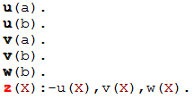
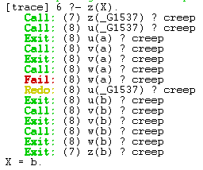
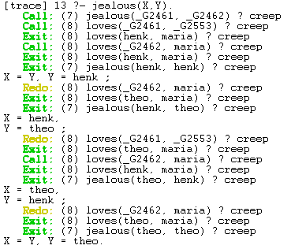
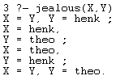
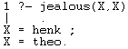

---
# Proof Search

* Knowledge Database is read from top to bottom
* Variables are replaced by shared variables
* A search is done in a depth first fashion

---
# Backtracking

* When a search path is not valid, **backtracking** occurs:
* Traversing the tree in opposite direction until a variable binding is reached
* If a result is found, one can choose to continue the search by backtracking, using the "**;**" command

---
# A simple example (1)

Knowledge database:

{ width=80% }

---
# A simple example (2)

{ width=45% }

{ width=45% }

---
# A more complicated example (1)

Knowledge database:

{ width=80% }

---
# A more complicated example (2)

{ width=45% }

{ width=45% }

---
# A more complicated example (3)
* Results not always as expected.
* jealous(X,Y):
* 
{ width=45% }

* jealous(X,X)

{ width=45% }
---
# Powerful basis for logical inference

text

---

!

<!-- Local Variables:  -->
<!-- pandoc/write: beamer -->
<!-- pandoc/latex-engine: "xelatex" -->
<!-- pandoc/template: "beamer-template.tex" -->
<!-- End:  -->
