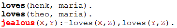

# Proof Search

* The manner in which a query is handled
* Knowledge Database is read from top to bottom
* Tries to unify with facts and heads of rules
* At first valid encounter, unification is carried out
* Variables are replaced by internal variables (e.g. _G2145)
* A search is done in a depth first fashion in a tree-shaped structure

# Backtracking

* When a search path is not valid, **backtracking** occurs:


  	Traversing the tree in opposite direction until a variable binding (choise point) is reached

* If a result is found, one can choose to continue the search by using backtracking, using the **;** command

# A simple example (1)

Knowledge database:

{ width=50% }

# A simple example (2)

{ width=45% } { width=45% }

# A more complicated example (1)

Knowledge database:

{ width=50% }

# A more complicated example (2)

{ width=45% } { width=45% }

# A more complicated example (3)
* Results are not always as expected

* jealous(X,Y):
 
{ width=30% }

* jealous(X,X)

{ width=30% }

# Powerful basis for logical inference

* Combining unification and backtracking into search trees results in a fast tool for logical inference
* Understanding of underlying concepts is important to understand results produced
* Various implementations might grant diffrent results, when cosidering a query like:

```
?- father(X) = X
```

<!-- Local Variables:  -->
<!-- pandoc/write: beamer -->
<!-- pandoc/latex-engine: "xelatex" -->
<!-- pandoc/template: "beamer-template.tex" -->
<!-- End:  -->
