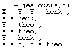

# What is logic programming?
Logic programming is a type of programming paradigm which is largely based on formal logic. Any program written in a logic programming language is a set of sentences in logical form, expressing facts and rules about some problem domain. In logic programing, rules are written in the form of clauses:
```prolog
H :- B1, ..., Bn.
```

and are read declaratively as logical implications:
```
H if B1 and ... and Bn.
```

```H``` - head of the rule; ```B1, ..., Bn``` - the body; ```H.``` - facts


# What is Prolog? (1)

Prolog (PROgramming in LOGic) is a logic programming language that allows us to *program* with declarative knowledge.The language was first conceived by a group around Alain Colmerauer in Marseille, France, in the early 1970s and the first Prolog system was developed in 1972 by Colmerauer with Philippe Roussel.It was developed from a foundation of logical theorem proving and originally used for research in natural language processing.

# What is Prolog? (2)

* A general-purpose logic programming language.
* One of the first and most popular logic programming language available.
* Originally intended as a way to process natural language.

SWI Prolog (http://www.swi-prolog.org/) one of the most mature implementations of Prolog.

# Application of Prolog

Prolog is still being used nowadays in various industrial, medical and commercial areas to:

* Build expert systems that solve complex problems without the help of humans (e.g. automatically planning, monitoring, controlling and troubleshooting complex systems)
* Build decision support systems that aid organizations in decision-making (e.g. decision systems for medical diagnoses)
* For online support service for customers, etc.

# Knowledge database
* Prolog programs have two parts: a database (of facts and rules), and an interactive *query* tool.
* Prolog databases are *consulted* (loaded), and then the query tool is used to *make queries* (ask questions) about the database.
* How queries are answered is generally beyond the control of the programmer; Prolog uses a depth-first search to figure out how to answer queries.
* *Programs* written in Prolog are *executed* by performing queries.

# Terms

* Building blocks of facts, rules, and queries.

* Four types of terms:
    * atoms;
    * numbers (both are called constants);
    * variables;
    * complex terms.

# Atom

Either:

* String of characters (upper-case, lower-case, digits, _), begins with lower-case ch.
E.g.: big_kahuna_burger, listens2Music.

* Arbitrary string of characters enclosed in '...' (single).
E.g: 'The Beatles', ' &^%&#@$  &* '.

* String of special characters (e.g. ; or :-)
E.g: in rule syntax ```term1 :- term2; ```


# Numbers

* Floats (e.g. 1657.3087 or π)
* Integers (23 , 1001 , 0 , -365)
* Straigthforward syntax

# Variable

* Starts with upper-case letter or _
(E.g: X, Y_50, List1, _input)

* Anonymous variable _ 

# Complex term

* Building block: functor (which is an atom) with arguments (terms)
E.g: `playsAirGuitar(jody), loves(vincent,mia).`

* Nested functors make up complex terms 
E.g: `and(big(burger),kahuna(burger)).`, `vertical(line(point(X,Y),point(X,Z))).` 

# Clauses

* Rules (clauses) state information that is conditionally true of the situation of interest.

* ```term1 :- term2```

* term1 is true if term2 is true.


# Some examples again
```
father(Y,Z):-  man(Y),  son(Z,Y).
wizard(X):-  hasBroom(X),  hasWand(X).
```

# Unification (how it works)

Two terms unify if they are the same term or if they contain variables that can be uniformly instantiated with terms in such a way that the resulting terms are equal.

# What does this mean?

Some examples:

* ```x = 1.```
* ```list(X, X) = list(1, 2)```
* ```X = father(X)```

# More on unification

* Two terms either unify or not.
* If they unify, it is interesting to know how the variables have to be instantiated to make the terms unify.

# More precise rules:

Two terms (term1 and term2) unify:

* (1) If they are both constants, they unify iff they are the same atom (or number)
* (2) If term1 is a variable and term2 is any term, then they unify and term1 is instantiated to term2.
* (3) If both terms are variables, they're both instantiated to each other.
* (4) If both are complex terms and ... (next slide)
* (5) Iff it follows from the rules above that they unify.

# Some examples first

Terms that unify:

* (1) ```burger_1``` and ```burger_1```

* (2) ```X``` and ```vincent``` (```X``` is instantiated to ```vincent```)

* (3) ```X``` and ```Y```

# For complex terms:

If term1 and term2 are complex terms, they unify iff:

* They have the same functor and arity (nr. of args)

* All their corresponding arguments unify

* The variable instantiations are compatible

# Example:

Knowledge base (KB):
```vertical(line(point(X,Y),point(X,Z)))```
Query:
```vertical(line(point(1,1),point(2,3))). ```

Processing logic:

* 1. Try unification of the complex term vertical(1 argument) in the query to that in the KB.

* 2. Try unification of the functor (complex term) *line* in query and KB.

* 3. Try unification of the arguments of the functor *line*.

* 4. ... Unify point(1, 1) with point(X, Y), instantiate X to 1 and Y to 1.

* 5. Unify point(1, 3) with point(X, Z). Conflict: X has been inst.-ed to 1 and cannot unify with 2 now.

* 6. Hence, two complex terms do not unify.

# Proof Search

* The manner in which a query is handled
* Knowledge database is read from top to bottom
* Tries to unify with facts and heads of rules
* At first valid encounter, unification is carried out
* Variables are replaced by internal variables (e.g. _G2145)
* A search is done in a depth first fashion in a tree-shaped structure

# Backtracking

* When a search path is not valid, **backtracking** occurs:

Traversing the tree in opposite direction until a variable binding (choice point) is reached

* If a result is found, one can choose to continue the search by using backtracking, using the **;** command

# A simple example (1)

Knowledge database:

{ width=50% }

# A simple example (2)

{ width=45% } { width=45% }

# A more complicated example (1)

Knowledge database:

{ width=50% }

# A more complicated example (2)

{ width=40% } { width=60% }

# A more complicated example (3)
* Results are not always as expected

* jealous(X,Y):
 
{ width=30% }

* jealous(X,X)

{ width=30% }

# Powerful basis for logical inference

* Combining unification and backtracking into search trees results in a fast tool for logical inference
* Understanding of underlying concepts is important to understand results produced
* Various implementations might grant diffrent results, when considering a query like:

```
?- father(X) = X
```

# Recursion
We have multiple ways to use recursion: in the database
for example we can make properties transitive.
```
dadof(you,dad).
dadof(dad,granddad).
dadof(granddad, petethegreat).
momof(petethegreat,eve)
ancestorof(X,Y):- dadof(X,Y).
ancestorof(X,Y):- momof(X,Y).
%naive: ancestorof(X,Y):- ancestorof(X,Z),ancestor(Z,Y).
```
. . .

```
%better:
ancestorof(X,Y):- dadof(X,Z),ancestor(Z,Y).
ancestorof(X,Y):- momof(X,Z),ancestor(Z,Y).
```

# Recursion on lists
Suppose we have a list of group members,
`[roald, winand, anvar, alexey, sjoerd]`

. . .

... we can declare a member of this group to be part of this list using recursion i.e.
```
member(H, [H|T])

member(X, [H|T]) :- member(X,T) 
```
. . .

So when we search for members we can simply search

`?- member(anvar,[roald, winand, anvar, alexey, sjoerd])`

which would say *yes*.

# Recursion
In prolog we do have to be careful when using recursion, for example with:

```
something :- something.
```

...

... we also want to use tail recursion in favour of head recursion:
```
lengthH([],0).
lengthH([H|T],N):- lengthH(T,X), N is X+1.
lengthT([H|T],A,L) :- Anew is A+1, lengthT(T,Anew,L).
lengthT([],L,L).
lengthTail(List,L) :- lengthT(List,0,L). %to make it nicer
```

# The cut atom (1)
Take this simple knowledge base:
```prolog
bar(a).
bar(b).
baz(a).
baz(b).

foo(X, Y) :- bar(X), baz(Y).
```

Backtracking over ```foo(X, Y)``` gives the tree:

{ width=100% }

# The cut atom (2)

{ width=100% }

Querying ```foo(X, Y)``` will give the results: 

```
(X, Y) = (a, a); (a, b); (b, a); (b, b).
```

But what if you would only like to get the first n results?

# The cut atom (3)

A *cut* is an atom that can be used to influence the backtracking in Prolog.
It tells Prolog to ignore backtracking up to the point it encounters a cut:

```prolog
foo(X, Y) :- bar(X), !, baz(Y).
```

The query ```foo(X, Y).``` now gives the results: 

```
(X, Y) = (a, a); (a, b).
```

# How cut works (1)

Lets see what actually happens:

{ width=100% }

# How cut works (2)

Moving the cut from left to right,

```prolog
foo(X, Y) :- 1, bar(X), 2, baz(Y), 3.
```

will yield the results:


```prolog
(0) (X, Y) = (a, a); (a, b); (b, a); (b, b).
(1) (X, Y) = (a, a); (a, b); (b, a); (b, b).
(2) (X, Y) = (a, a); (a, b).
(3) (X, Y) = (a, a).
```
These results show how cut actually works!

# Types of cut (1)

There are two *types* of cuts: green and red cuts.

Cuts are considered green in case they only make a program more efficient, without changing its output:
```prolog
drunk(X) :- beer(X), !.
drunk(X) :- money(X), \+ beer(X).
```

Without the cut, it will backtrack.
This example will keep functioning when the first line is removed.

# Types of cut (2)
When cuts are not green they are red, hence they influence the output of a program:

```prolog
drunk(X) :- beer(X), !.
drunk(X) :- money(X).
```

In this case the output will be different when the first line is removed.
Without the cut this example will yield two results, while the previous example will yield only one.

In the second example you aren't checking whether you still have beer... (or you are really really drunk).

# Usage cut
Some advices about the usage of *cut*:

* It can make a program much more efficient and prevent it from going down branches that are not interesting.
* It commits the goal to being proven, hence is must be used when the alternative must not be tried.
* There are alternatives for the usage of cuts, like *once*.
* Using cut correct requires an intrinsic understanding of logic and Prolog, so when there is a way around it, try to avoid the use: it will make life a much more pleasant for everyone!

# Further reading

* Prolog - Wikipedia (nl.wikipedia.org/wiki/Prolog)
* SWI-Prolog (www.swi-prolog.org)
* Learn Prolog Now! (www.learnprolognow.org)
* Prolog - Wikibooks (en.wikibooks.org/wiki/Prolog)